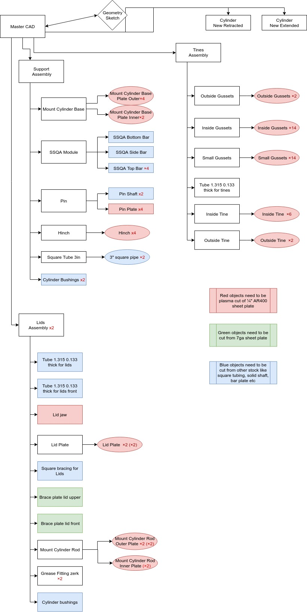

## What is the content in this folder and how to use it
The CAD structure is a diagram that allows you to understand different aspects of the design including:
* Dependencies and relations between parts.
* Fabrication related information like which parts will be manufactured with what process.
* Assembly and subassembly structures, very important to understand how to replicate the machine.

